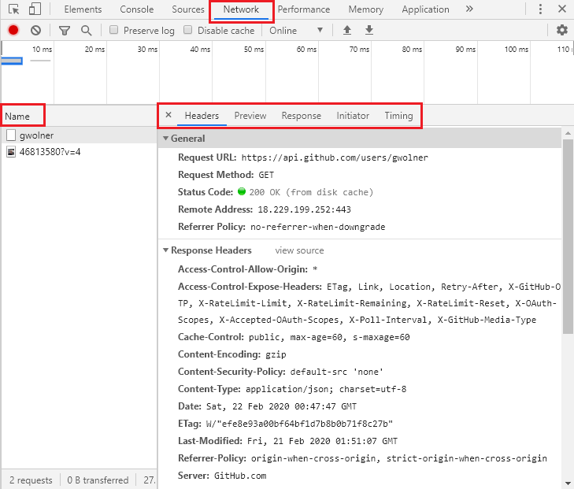
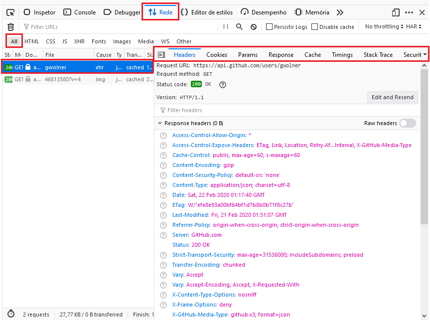

# Github avatar  

Aplicação web que foca no uso de diferentes formas de requisições assíncronas (AJAX) utilizando uma API do Github de modo que, ao fornecer o nome do usuário, seu avatar seja exibido.

## Proposta

O intuito da aplicação é mostrar que apenas o avatar é carregado, sem interferir nos demais elementos presentes na página, como ocorre em alguns sites em que toda a página é recarregada para atualizar um único conteúdo. A aplicação é uma adaptação das prática da [Rocketseat](https://rocketseat.com.br/) sobre AJAX. 

Os tipos de requisições assíncronas usadas para exibir o avatar fazem uso do <b>XMLHttpRequest</b>, <b>Promises</b> e <b>API Axios</b> em momentos distíntos e de forma editável, de modo que se possa observar o comportamento de cada tipos.

## API Github

O avatar será disponibilizado pela API Github quando forem feitas requisições para a URL abaixo:

```js
https://api.github.com/users/[username]
```
Onde o [username] deve ser substituido pelo nome de um usuário válido na plataforma.

A consulta retornará várias informações além do avatar. Entratanto, para esta aplicação a imagem de usuário é sufieinte, a fim de não expor outros dados do usuário.

## Alternando entre os tipos

No arquivo index.html, antes do fechamento da tag body, existe uma área reservada para importar o arquivo AJAX que se deseja utilizar para carregar o avatar.

```html
17. <!-- Importações JS abaixo-->
18. 
19. 
```

A linha 18 será usada para importar os arquivos avatarXhr.js e avatarPromises.js, já o arquivo   

* Uso do XMLHttpRequest

Na linha 18, adicionar o arquivo avatarXhr.js.
```html
<script src="avatarXhr.js"></script>
```

* Uso das Promises

Na linha 18, adicionar o arquivo avatarXhr.js.

```html
<script src="avatarPromises.js"></script>
```

* Usando API Axios

Importar o arquivo axios.min.js na linha 18 e o arquivo avatarAxios.js na linha 19 conforme abaixo.
```html
<script src='https://unpkg.com/axios/dist/axios.min.js'></script>
<script src="avatarXhr.js"></script>
```
Essa ordem é <b>importante</b>, pois primeiro deverá ser carregado a API Axios para depois ser carregado o código que faz uso dela.

## Entendendo o código

### Classe XMLHttpRequest

Objeto que dá acesso a funcionalidade do AJAX.
```js
var xhr = new XMLHttpRequest();
```

Monta a requisição de dados do servidor. Primeiro o método e segundo a URL.
```js
xhr.open("GET", "https://api.github.com/users/gwolner");
```

Envio da requisição montada acima. Como não vai enviar parâmetros adicionais, usá-se null.
```js
xhr.send(null);
```

Monitora mudança de status da requisição assincrona:
```js
xhr.onreadystatechange = function() { //Acionar uma função quando o status da requisição for atualizado.
  if (xhr.readyState === 4) { //4 é o valor de quando há resposta do servidor.
    console.log(JSON.parse(xhr.responseText)); //O xhr.responseText retorna um JSON.
  }
};
```

### Classe Promises

Cria-se uma função normal, mas com um return da classe Promise.
```js
let myPromise = function() {
  return new Promise(function(resolve, reject) {
    
    //Código dentro da Promise
    
  });
}
```
O resolve e reject são funções referenciadas passadas como parâmetro.

O código dentro da Promise é um XMLHttpRequest, porém no seu If/Else usa-se as funções <b>resolve</b> e <b>reject</b> para tratar sucesso e falha, respectivamente, durante a requisição.

```js
xhr.onreadystatechange = function() {
    if (xhr.readyState === 4) {
        if (xhr.status === 200) {
            resolve("Requisição feita com sucesso!");
        } else {
            reject("Falha na requisição!");
        }
    }
};
```

Observe que a Promise foi criada, mas não chamada. Chamamos a Promisse como qualquer outra função.
``` js
myPromise()
```

Como mencionado anteriormente, a Promise lida com sucesso e falha e para isso a função chamada precisa fazer uso dos métodos THEN e CATCH.
```js
myPromise()
    .then(function(resolve) {
        console.log("Avatar exibido!");
    })
    .catch(function(error) {
        console.warn("Nome de usuário não encontrado!");
    });
```
O método THEN trata do caso de sucesso (observe que ele tem uma referência à função resolve) e o CATCH trata dos casos de falha (a referência à função reject não é explícita, pois recebe o nome de "error" e não de "reject").

### API Axios

Em vez de uma função, chama-se a API Axios, seguida do método de envio que se deseja usar (GET, POST, HEAD, etc) e passando a  URL da requisição como parâmetro. 
```js
axios.get("https://api.github.com/users/"+username)
  .then(function(resolve){
      console.log("Avatar exibido!");
  })
  .catch(function(error){
      alert("Nome de usuário não encontrado!");
  });
```
Para mais parâmetros no get(), deve-se usar vírgula após a URL informada.

## Analisando requisições

Essa análise pode ser feita dentro do navagador, diretamente na Área do Desenvolvedor (F12).

### No Google Chrome

Pode-se verificar a requisição na aba <b>Network</b>, onde o nome da requisição será exibido. Próximo a ela deverá ter a aba <b>Hearders</b> exibindo o status da requisição e na aba <b>Preview</b> pode-se ver a resposta do servidor. Navegue pelas abas para visualiar mais detalhes da requisição.

 

### No Mozilla Firefox

Acesse a aba <b>Rede</b>, verifique se a opção <b>All</b> está selecionada e então clique sobre o nome da requisição. A aba <b>Hearders</b> estará marcada por defaul e na aba <b>Response</b> é possível visualizar a resposta do servidor. Navegue pelas abas para visualiar mais detalhes da requisição.



